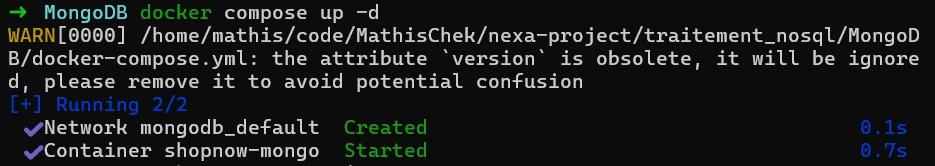
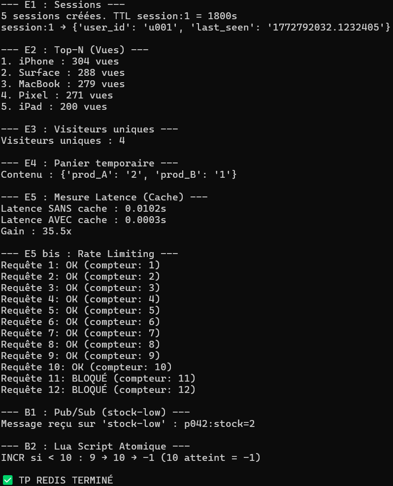
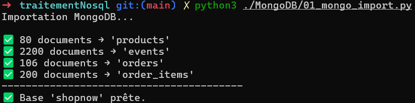
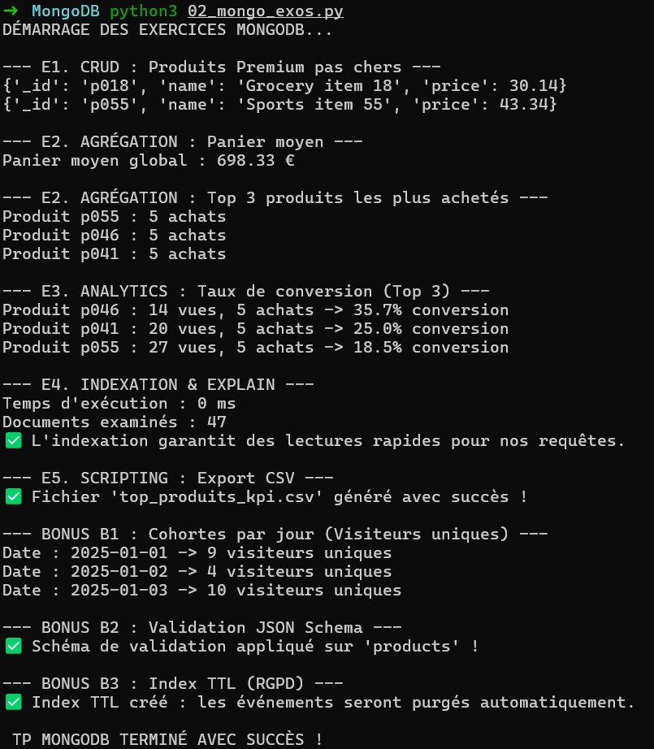
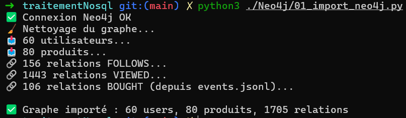
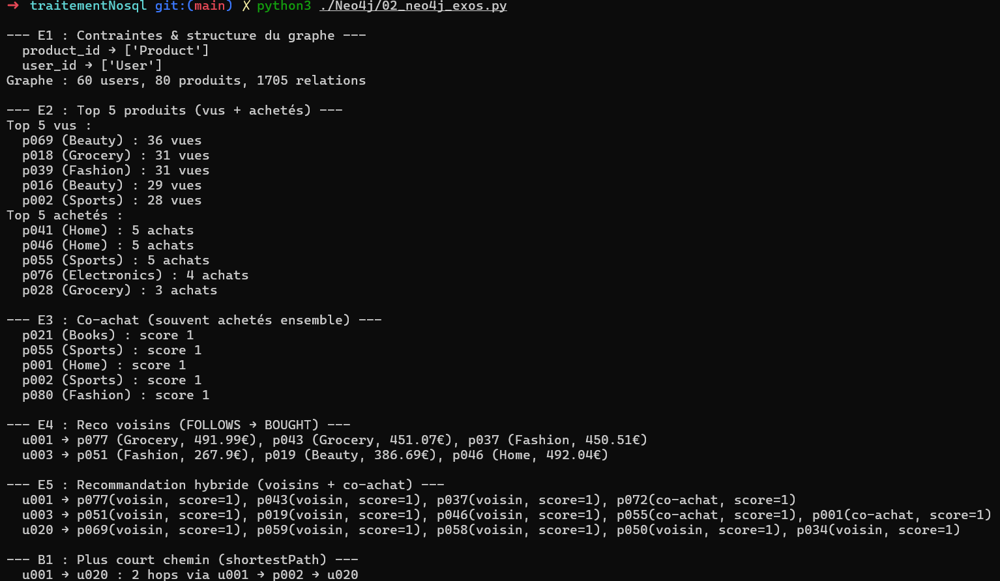
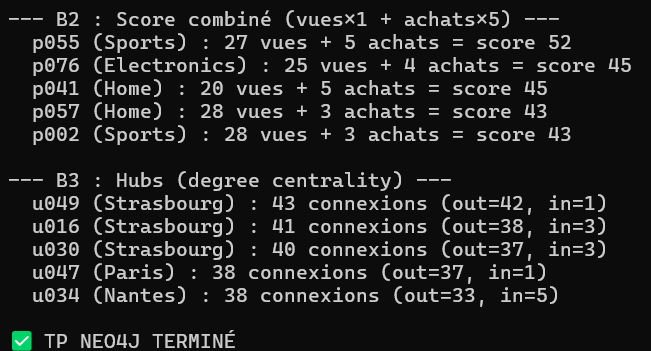

# TP Traitement NoSQL — ShopNow

> M1 Data & IA · Redis + MongoDB + Neo4j · Fil rouge e-commerce

## Infrastructure

```bash
docker compose up -d
```



Les trois services (Redis, MongoDB, Neo4j) tournent dans des conteneurs Docker indépendants, accessibles sur leurs ports par défaut.

---

## TP 1 — Redis

**Script :** `Redis/Exercice_redis.py`

| Exercice | Structure Redis | Objectif |
|----------|----------------|----------|
| E1 | Hash + `EXPIRE` | Sessions utilisateur (TTL 30 min) |
| E2 | Sorted Set (`ZADD`) | Top-N produits vus par score |
| E3 | Set (`SADD` + `SCARD`) | Comptage visiteurs uniques (dédupliqués) |
| E4 | Hash + `EXPIRE` | Panier temporaire (TTL 1h) |
| E5 | String (`GET`/`SET`) | Benchmark latence cache vs DB (100 itérations) |
| E5 bis | `INCR` + `EXPIRE` | Rate limiting par fenêtre de 1 minute |
| B1 | Pub/Sub | Alerte `stock-low` (publisher → subscriber) |
| B2 | Lua script | Incrémentation atomique conditionnelle |

### Résultats



### Analyse de performance (E5)

Lors de l'exercice 5, nous avons mesuré un gain de latence massif en comparant un appel de base de données classique à un accès en cache, validant notre besoin de latence faible pour ShopNow. Cette accélération s'interprète par la nature in-memory de Redis : en évitant les accès disques (I/O) réguliers, le système répond avec une complexité en $O(1)$ pour des clés simples. De plus, les structures avancées de Redis, comme les Sorted Sets (`ZSET`), permettent d'aller plus loin que le simple cache en appliquant le concept de sliding window (fenêtre glissante). Si cette technique est idéale pour le filtrage de requêtes (rate limiting), elle l'est tout autant pour optimiser la pagination : au lieu d'utiliser un `OFFSET` classique dont les performances s'effondrent sur les pages profondes, récupérer les données en glissant sur le score (souvent un timestamp) garantit une complexité logarithmique $O(\log(N))$, maintenant l'API ultra-réactive même lors des pics de trafic e-commerce.

---

## TP 2 — MongoDB

**Scripts :** `MongoDB/01_mongo_import.py` → `MongoDB/02_mongo_exos.py`

### Import des données



4 collections importées dans la base `shopnow` : 80 produits, 2200 events, 106 orders, 200 order_items.

### Exercices

| Exercice | Pipeline / Méthode | Résultat clé |
|----------|-------------------|--------------|
| E1 | `find()` + projection | Produits premium < 50€ |
| E2 | `$group` + `$avg` / `$sum` | Panier moyen : 698.33€ · Top 3 produits |
| E3 | `$cond` + `$divide` | Taux de conversion (views → buys) jusqu'à 35.7% |
| E4 | `createIndex` × 2 + `explain()` | Index `events(product_id, ts)` + `products(category, price)` |
| E5 | `csv.writer` | Export `top_produits_kpi.csv` |
| B1 | `$addToSet` + `$size` | Cohortes : visiteurs uniques par jour |
| B2 | `collMod` + `$jsonSchema` | Validation obligatoire `name` + `price` |
| B3 | `createIndex` TTL | Purge auto events > 30 jours |

### Résultats



---

## TP 3 — Neo4j

**Scripts :** `Neo4j/01_import_neo4j.py` → `Neo4j/02_neo4j_exos.py`

### Modèle du graphe

```
(:User {id, city, age_range})
(:Product {id, name, category, price})

(User)-[:FOLLOWS]->(User)
(User)-[:VIEWED {count}]->(Product)
(User)-[:BOUGHT {ts, count}]->(Product)
```

**Note sur les relations BOUGHT :** les fichiers CSV fournis pour Neo4j (`neo4j_users`, `neo4j_products`, `neo4j_follows`, `neo4j_viewed`) ne contiennent pas de données d'achat, alors que le modèle du cours (slide 26) prévoit une relation `(User)-[:BOUGHT {ts, qty}]->(Product)` nécessaire aux exercices E3 (co-achat), E4 (reco voisins) et B2 (score combiné). Pour compléter le graphe, nous avons extrait les 106 événements de type `buy` depuis `events.jsonl` (données MongoDB) et les avons injectés comme relations BOUGHT, agrégées par paire `(user, product)` via `MERGE ... ON CREATE / ON MATCH`.

### Import



60 utilisateurs, 80 produits, 1705 relations (156 FOLLOWS + 1443 VIEWED + 106 BOUGHT).

### Exercices

| Exercice | Requête Cypher | Objectif |
|----------|---------------|----------|
| E1 | `SHOW CONSTRAINTS` | Vérification contraintes unicité |
| E2 | `MATCH ... RETURN ... ORDER BY DESC` | Top 5 produits vus + Top 5 achetés |
| E3 | Co-achat (double `MATCH`) | "Souvent achetés ensemble" |
| E4 | `FOLLOWS → BOUGHT` (2-hop) | Reco voisins (produits non achetés) |
| E5 | Fonction Python `recommend()` | Reco hybride : voisins + co-achat |
| B1 | `shortestPath` | Plus court chemin entre deux users |
| B2 | Score pondéré `views + buys×5` | Classement combiné popularité |
| B3 | Degree centrality | Détection des hubs (users les plus connectés) |

### Résultats




---

## Arborescence

```
.
├── docker-compose.yml
├── README_TP.md
├── screenshots/
│   ├── docker_compose_up.png
│   ├── redis_results.png
│   ├── mongo_import.png
│   ├── mongo_exos.png
│   ├── neo4j_import.png
│   ├── neo4j_exos_part_1.png
│   └── neo4j_exos_part_2.png
├── Redis/
│   └── Exercice_redis.py
├── MongoDB/
│   ├── 01_mongo_import.py
│   ├── 02_mongo_exos.py
│   ├── top_produits_kpi.csv
│   ├── products.jsonl
│   ├── events.jsonl
│   ├── orders.jsonl
│   └── order_items.jsonl
└── Neo4j/
    ├── 01_import_neo4j.py
    ├── 02_neo4j_exos.py
    ├── neo4j_users.csv
    ├── neo4j_products.csv
    ├── neo4j_follows.csv
    └── neo4j_viewed.csv
```
